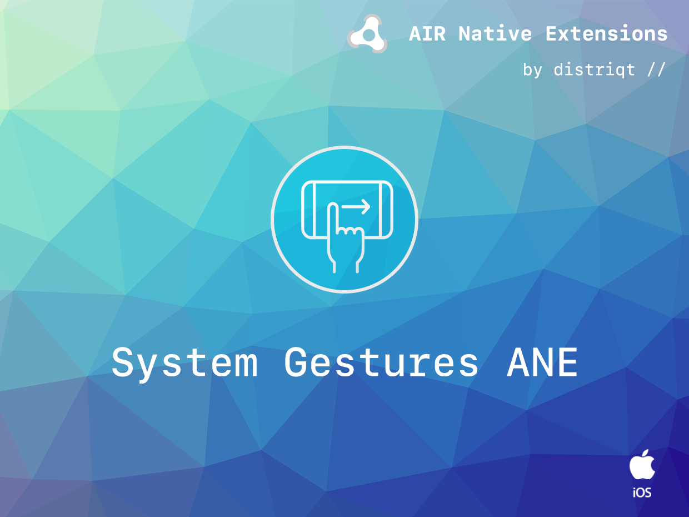

built by [distriqt //](https://airnativeextensions.com) 



# SystemGestures

The [SystemGestures](https://airnativeextensions.com/extension/com.distriqt.SystemGestures) extension 
gives you the ability to control the system gestures, particularly on iOS 11 +.

### Features

- Defer screen edge gestures to allow your immersive application access to edge gestures
- Sample project code and ASDocs reference


## Documentation

Latest documentation can be found in the [wiki](https://github.com/distriqt/ANE-SystemGestures/wiki)

Quick Example: 

```actionscript
SystemGestures.service.setDeferredScreenEdges( ScreenEdges.BOTTOM );
```


## Native Extensions

The highest quality and widest range of Native Extensions for Adobe AIR

With many native extensions available, we are the leading provider of native extensions for AIR developers. 
Our mobile solutions allow developers to fast-forward development and focus on building great games and apps.

[https://airnativeextensions.com](https://airnativeextensions.com)


## Acknowledgements

This extension was made possible with support by **BeachBum Ltd.**


