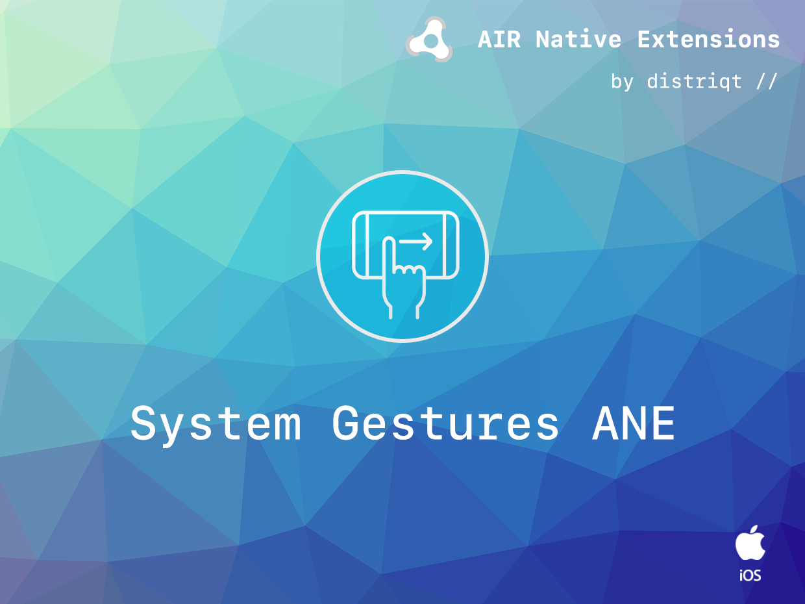
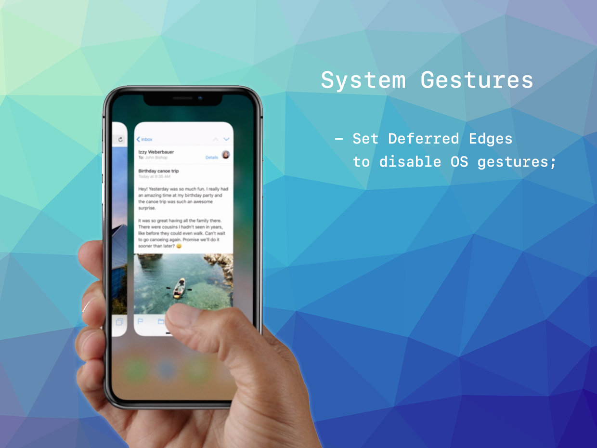

# SystemGestures

The [SystemGestures](https://airnativeextensions.com/extension/com.distriqt.SystemGestures) extension 
gives you the ability to control the system gestures, particularly on iOS 11 +.

### Features

- Defer screen edge gestures to allow your immersive application access to edge gestures

This Wiki forms the best source of detailed documentation for the extension along with 
the [asdocs](https://distriqt.github.io/ANE-SystemGestures/asdocs). 

